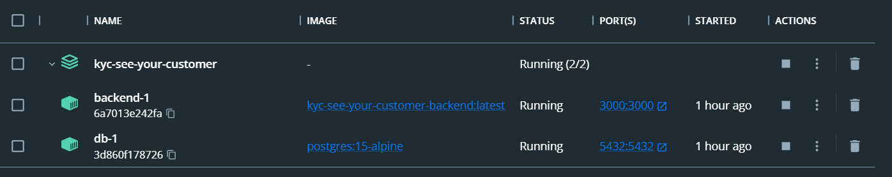

# C. Technická dokumentácia

<!-- toc -->
- [C. Technická dokumentácia](#c-technická-dokumentácia)
  - [Inštalácia a konfigurácia](#inštalácia-a-konfigurácia)
    - [Predpoklady](#predpoklady)
    - [Inštalačné kroky](#inštalačné-kroky)
    - [Vstup do administračného rozhrania](#vstup-do-administračného-rozhrania)
  - [Backendová časť](#backendová-časť)
    - [Prehľad architektúry](#prehľad-architektúry)
    - [Popis hlavných komponentov](#popis-hlavných-komponentov)
    - [API dokumentácia](#api-dokumentácia)
      - [POST `/verification`](#post-verification)
        - [Vstup](#vstup)
        - [Výstup](#výstup)
      - [POST `/login`](#post-login)
        - [Vstup](#vstup-1)
        - [Výstup](#výstup-1)
      - [GET `/verification/status/:birthNumber`](#get-verificationstatusbirthnumber)
        - [Výstup](#výstup-2)
      - [GET `/verification`](#get-verification)
        - [Výstup](#výstup-3)
      - [GET `/verification/:id`](#get-verificationid)
        - [Výstup](#výstup-4)
      - [PUT `/verification/:id`](#put-verificationid)
        - [Vstup](#vstup-2)
        - [Výstup](#výstup-5)
    - [Databázova schéma](#databázova-schéma)
  - [Frontendová časť](#frontendová-časť)
    - [Prehľad architektúry](#prehľad-architektúry-1)
    - [Stavové riadenie](#stavové-riadenie)
    - [Konfigurácia Routera](#konfigurácia-routera)
      - [Definícia Routera](#definícia-routera)
      - [Prehľad Ciest](#prehľad-ciest)
        - [1. Domovská Stránka](#1-domovská-stránka)
        - [2. Osobné Informácie](#2-osobné-informácie)
        - [3. Skenovanie Dokumentov](#3-skenovanie-dokumentov)
        - [4. Rozpoznávanie Tvárí](#4-rozpoznávanie-tvárí)
        - [5. Záverečná Stránka](#5-záverečná-stránka)
        - [6. Admin Prihlásenie](#6-admin-prihlásenie)
        - [7. Admin Stránka](#7-admin-stránka)
        - [8. Verifikačný Profil](#8-verifikačný-profil)
      - [Dynamické Parametre](#dynamické-parametre)
      - [Základná URL](#základná-url)
    - [API definícia pomocou RTK Query](#api-definícia-pomocou-rtk-query)
      - [Importy](#importy)
      - [Definícia služby](#definícia-služby)
      - [Endpointy](#endpointy)
        - [getAllVerifications](#getallverifications)
        - [getVerificationDetails](#getverificationdetails)
        - [getVerificationStatus](#getverificationstatus)
        - [updateVerification](#updateverification)
        - [postNewVerification](#postnewverification)
        - [postUserLogin](#postuserlogin)
      - [Export hookov](#export-hookov)
    - [Adresár `/components`](#adresár-components)
      - [Komponenty](#komponenty)
    - [Adresár `/pages`](#adresár-pages)
      - [Stránky](#stránky)
    - [Pomocné funckie](#pomocné-funckie)
      - [Funkcia: `startFaceDetection`](#funkcia-startfacedetection)
      - [Parametre](#parametre)
      - [Popis](#popis)
      - [Kód](#kód)
      - [Popis kódu](#popis-kódu)
    - [Funkcia: `validateBirthNumber`](#funkcia-validatebirthnumber)
      - [Parametre](#parametre-1)
      - [Popis](#popis-1)
      - [Kód](#kód-1)
      - [Popis kódu](#popis-kódu-1)
    - [Funkcia `toBase64`](#funkcia-tobase64)
        - [Popis](#popis-2)
        - [Parametre](#parametre-2)
        - [Návratová hodnota](#návratová-hodnota)
        - [Algoritmus](#algoritmus)
        - [Kód](#kód-2)
        - [Použitie](#použitie)
    - [Funkcia: `handleImageUpload`](#funkcia-handleimageupload)
      - [Popis](#popis-3)
      - [Parametre](#parametre-3)
      - [Návratová hodnota](#návratová-hodnota-1)
      - [Algoritmus](#algoritmus-1)
      - [Kód](#kód-3)
    - [Funkcia: `runOCR`](#funkcia-runocr)
      - [Popis](#popis-4)
      - [Parametre](#parametre-4)
      - [Návratová hodnota](#návratová-hodnota-2)
      - [Algoritmus](#algoritmus-2)
      - [Kód](#kód-4)

<!-- tocstop -->

## Inštalácia a konfigurácia

### Predpoklady
- Docker Desktop [link](https://www.docker.com/products/docker-desktop/)

### Inštalačné kroky
1. **Uistite sa že máte správne nainštalovaný a spustený docker**:
    Otvorte príkazovy riadok a zadajte prikaz
    ```
    docker
    ```
    Mala by sa zobraziť nasledujúca časť 

    ```
    Usage:  docker [OPTIONS] COMMAND

    A self-sufficient runtime for containers

    Options:
        ...
    ```
    
  
2. **Definovanie .env súboru**
  V zdrojovom adresáry projektu sa nachádza súbor `.env.example`, ktorý zduplikujeme a jeho názov zmeníme na `.env`

    Obsah suboru: `.env`

    ```
    DB_USER='root'
    DB_PASSWORD="secretPassword"
    DB_CONNECTION=postgresql://${DB_USER}:${DB_PASSWORD}@db:5432/mydb #DO NOT CHANGE
    ```

    Možné je konfigurovať všetky premenné, za ktorými sa neachádza komentár `DO NOT CHANGE`


3. **Spustenie aplikácie**
   1. Otvoríme si príkazovy riadok v zdrojovom adresári projektu (adresár v ktorom sa nachádza súbor `docker-compose.yaml` )
   2. Zadáme príkaz 
   ```
   docker-compose up -d
   ```
   3. Po skončení procesu inštalácie, budeme vidieť v aplikácií docker nasledovný container
    
  
4. **Vstup do aplikácie**
  Po úspešnom procese inštalácie je aplikácie prístupna na adrese http://localhost:3000/

### Vstup do administračného rozhrania

V prípade, že chceme vstupiť do administrašného rozhrania môžeme tak učiniť na adrese http://localhost:3000/#/admin

Aktuálne v aplikácií existuje iba jeden administratorský učet s menom aj heslom `admin`. Tento administrátor je vždy vytvorený pri inicializácií projektu pri spústeni súboru `/server/prisma/seed.ts`

```Typescript
import { prisma } from "../prisma"

async function seed() {
   await prisma.user.upsert({
        where: {
            userName: "admin"
        },
        update: {},
        create: {
            userName: "admin",
            password: "admin"
        }
    })
}

seed()

```

## Backendová časť

### Prehľad architektúry
Backend je postavený na Node.js a používa Prisma ORM na správu databázy. Hlavné technológie zahŕňajú:

- Node.js: JavaScript runtime na strane servera
- TypeScript: Statické typovanie pre JavaScript
- Prisma: ORM na interakciu s databázou

### Popis hlavných komponentov
- **index.ts**: Hlavný vstupný bod servera. Nastavuje a spúšťa server.
- **prisma.ts**: Konfigurácia Prisma, obsahuje inicializáciu ORM a pripojenie k databáze.
- **utils.ts**: Obsahuje pomocné funkcie použité v rôznych častiach backendu.

### API dokumentácia

#### POST `/verification`
Endpoint na vytvorenie alebo aktualizáciu verifikácie osoby.

##### Vstup
- **Body**: `VerificationRequestBody`
    ```json
    {
        "birthNumber": "string",
        "personalInformation": {
            "firstName": "string",
            "lastName": "string",
            "gender": "male | female",
            "email": "string",
            "dateOfBirth": "YYYY-MM-DD",
            "streetNumber": "string",
            "city": "string",
            "ZIP": "string"
        },
        "faceRecognitionResult": {
            "faceMatched": true,
            "imageData": "base64string"
        },
        "documentInformation": {
            "imageData": "base64string"
        },
        "ocrResults": {
            "firstName": "string",
            "lastName": "string",
            "dateOfBirth": "YYYY-MM-DD",
            "birthNumber": "string"
        }
    }
    ```

##### Výstup
- **Status 200**: `Person`
- **Status 500**: `{"message": "Internal server error"}`

#### POST `/login`
Endpoint na prihlásenie používateľa.

##### Vstup
- **Body**: `{ userName: string, password: string }`

##### Výstup
- **Status 200**: `user?.id ?? null`
- **Status 500**: `{"message": "Internal server error"}`

#### GET `/verification/status/:birthNumber`
Endpoint na získanie stavu verifikácie podľa rodného čísla.

##### Výstup
- **Status 200**: `status`
- **Status 500**: `{"message": "Internal server error"}`

#### GET `/verification`
Endpoint na získanie zoznamu všetkých verifikácií.

##### Výstup
- **Status 200**: `[ { birthNumber: string, firstName: string, lastName: string, status: string } ]`
- **Status 500**: `{"message": "Internal server error"}`

#### GET `/verification/:id`
Endpoint na získanie detailov verifikácie podľa rodného čísla.

##### Výstup
- **Status 200**: `Person`
- **Status 404**: `{"message": "Verification with such birth number doesn't exist."}`
- **Status 500**: `{"message": "Internal server error"}`

#### PUT `/verification/:id`
Endpoint na aktualizáciu verifikácie podľa rodného čísla.

##### Vstup
- **Body**: `Partial<Verification>`

##### Výstup
- **Status 200**: `Person`
- **Status 404**: `{"message": "Verification with such birth number doesn't exist."}`
- **Status 500**: `{"message": "Internal server error"}`

### Databázova schéma

```
generator client {
  provider = "prisma-client-js"
}

datasource db {
  provider = "postgresql"
  url      = env("DB_CONNECTION")
}

model User {
  id       String @id @default(uuid())
  userName String @unique
  password String
}

model Person {
  birthNumber  String  @id @unique
  firstName    String
  lastName     String
  gender       Gender
  email        String
  dateOfBirth  String
  streetNumber String
  city         String
  ZIP          String
  faceMatched  Boolean
  status       Status  @default(processing)
  idPicture    String // Assuming Blob is stored as a string (base64 encoded)
  facePicture  String // Assuming Blob is stored as a string (base64 encoded)
}

enum Gender {
  male
  female
}

enum Status {
  processing
  redo
  verified
  prohibited
}

```

## Frontendová časť

### Prehľad architektúry

- **React.js**: Knižnica na tvorbu užívateľských rozhraní
- **TypeScript**: Statické typovanie pre JavaScript
- **Redux Toolkit**: Správa stavu aplikácie
- **RTK Query**: komunikacia s API
- **Tailwind CSS**: štýlovanie
- **face-api.js**: detekcia a porovnávanie tvári
- **Tesseract.js**: Spracovanie textu z fotografie


### Stavové riadenie
Redux sa používa na správu globálneho stavu aplikácie. Hlavné súbory zahŕňajú:
- **adminSlice.ts**: Obsahuje stav súvisiaci s adminom a akcie na jeho úpravu.
- **globalSlice.ts**: Obsahuje globálny stav aplikácie, ako napríklad používateľské nastavenia.
- **store.ts**: Hlavné nastavenie Redux storu, kombinuje všetky slice-y.

### Konfigurácia Routera

Táto konfigurácia routera používa `createHashRouter` na definovanie ciest pre React aplikáciu. Každá cesta špecifikuje trasu a komponent, ktorý sa má zobraziť pri prístupe na túto trasu.

#### Definícia Routera

```jsx
export const router = createHashRouter(
    [
        {
            path: "/",
            element: <Landing />
        },
        {
            path: "/personal-info",
            element: <InformationForm />
        },
        {
            path: "/document-scan",
            element: <DocumentScan />
        },
        {
            path: "/face-recognition",
            element: <FaceRecognition />
        },
        {
            path: "/final",
            element: <FinalPage />
        },
        {
            path: "/admin",
            element: <AdminLogin />
        },
        {
            path: "/admin-page",
            element: <AdminPage />
        },
        {
            path: "/verification/:id",
            element: <AdminProfile />
        }
    ],
    { basename: "/" }
);
```

#### Prehľad Ciest

##### 1. Domovská Stránka

- **Cesta:** `/`
- **Komponent:** `Landing`
- **Popis:** Toto je vstupná stránka aplikácie.

##### 2. Osobné Informácie

- **Cesta:** `/personal-info`
- **Komponent:** `InformationForm`
- **Popis:** Táto stránka obsahuje formulár na zber osobných informácií od používateľa.

##### 3. Skenovanie Dokumentov

- **Cesta:** `/document-scan`
- **Komponent:** `DocumentScan`
- **Popis:** Táto stránka umožňuje používateľovi skenovať a nahrávať dokumenty.

##### 4. Rozpoznávanie Tvárí

- **Cesta:** `/face-recognition`
- **Komponent:** `FaceRecognition`
- **Popis:** Táto stránka zabezpečuje funkciu rozpoznávania tvárí pre používateľa.

##### 5. Záverečná Stránka

- **Cesta:** `/final`
- **Komponent:** `FinalPage`
- **Popis:** Táto stránka zobrazuje posledný krok alebo potvrdenie po tom, ako používateľ dokončil všetky požadované úkony.

##### 6. Admin Prihlásenie

- **Cesta:** `/admin`
- **Komponent:** `AdminLogin`
- **Popis:** Toto je prihlasovacia stránka pre administrátorov.

##### 7. Admin Stránka

- **Cesta:** `/admin-page`
- **Komponent:** `AdminPage`
- **Popis:** Toto je hlavná stránka pre administrátorov, dostupná po prihlásení.

##### 8. Verifikačný Profil

- **Cesta:** `/verification/:id`
- **Komponent:** `AdminProfile`
- **Popis:** Táto stránka zobrazuje profil na verifikáciu, kde `:id` je dynamický parameter reprezentujúci ID používateľa.

#### Dynamické Parametre

- **Verifikačný Profil (`/verification/:id`):** 
  - Parameter `:id` v ceste je zástupný znak pre ID používateľa, ktorý sa použije na získanie a zobrazenie konkrétnych údajov používateľa v komponente `AdminProfile`.

#### Základná URL

- **Base Name:** `/`
- **Popis:** Vlastnosť `basename` je nastavená na `/`, čo znamená, že všetky cesty sú relatívne k rootu aplikácie.

---

Táto dokumentácia poskytuje jasný prehľad ciest, ich účelov a komponentov, ktoré zobrazujú. Ak potrebujete ďalšie detaily alebo úpravy, dajte mi prosím vedieť!

### API definícia pomocou RTK Query

Táto definícia API inštancie pomocou `@reduxjs/toolkit/query/react` poskytuje rôzne endpointy na komunikáciu s backendovým serverom. Definuje požiadavky na overovanie používateľov a spravovanie verifikácií.

#### Importy

```typescript
import {
    Verification,
    VerificationRequestBody,
    VerificationStatus
} from "@assets/types";
import { createApi, fetchBaseQuery } from "@reduxjs/toolkit/query/react";
```

#### Definícia služby

Vytvorenie API služby s použitím základnej URL a očakávaných endpointov:

```typescript
export const globalApi = createApi({
    reducerPath: "globalApi",
    baseQuery: fetchBaseQuery({ baseUrl: "http://127.0.0.1:3000/" }),
    tagTypes: ["Verifications"],
    endpoints: builder => ({
```

#### Endpointy

##### getAllVerifications
Získanie všetkých verifikácií.

```typescript
getAllVerifications: builder.query<
    Array<Partial<Verification> & Pick<Verification, "birthNumber">>,
    void
>({
    query: () => `verification`,
    providesTags: results =>
        results
            ? [
                  ...results.map(
                      ({ birthNumber }) =>
                          ({
                              type: "Verifications",
                              birthNumber
                          } as const)
                  ),
                  { type: "Verifications", id: "LIST" }
              ]
            : [{ type: "Verifications", id: "LIST" }]
}),
```

##### getVerificationDetails
Získanie detailov verifikácie podľa ID.

```typescript
getVerificationDetails: builder.query<Verification, string>({
    query: id => `verification/${id}`,
    providesTags: [{ type: "Verifications" }]
}),
```

##### getVerificationStatus
Získanie statusu verifikácie podľa ID.

```typescript
getVerificationStatus: builder.query<VerificationStatus | null, string>({
    query: id => `verification/status/${id}`
}),
```

##### updateVerification
Aktualizácia verifikácie podľa ID.

```typescript
updateVerification: builder.mutation<
    Verification,
    Partial<Verification> & Pick<Verification, "birthNumber">
>({
    query: ({ birthNumber, ...data }) => ({
        url: `verification/${birthNumber}`,
        method: "PUT",
        body: data
    }),
    invalidatesTags: (_result, _error, { birthNumber }) => [
        { type: "Verifications", birthNumber }
    ]
}),
```

##### postNewVerification
Vytvorenie novej verifikácie.

```typescript
postNewVerification: builder.mutation<
    Verification,
    VerificationRequestBody
>({
    query: data => ({
        url: `verification`,
        method: "POST",
        body: data
    })
}),
```

##### postUserLogin
Prihlásenie používateľa.

```typescript
postUserLogin: builder.mutation<
    string | null,
    { userName: string; password: string }
>({
    query: data => ({
        url: `login`,
        method: "POST",
        body: data
    })
})
```

#### Export hookov

Exportovanie hookov pre použitie v funkčných komponentoch, ktoré sú automaticky generované na základe definovaných endpointov.

```typescript
export const {
    useGetAllVerificationsQuery,
    useGetVerificationDetailsQuery,
    useUpdateVerificationMutation,
    usePostNewVerificationMutation,
    useLazyGetVerificationStatusQuery,
    usePostUserLoginMutation
} = globalApi;
```

### Adresár `/components`

Adresár `components` obsahuje samostatné React komponenty, ktoré sú znovupoužiteľné v rámci aplikácie. Tieto komponenty slúžia na vykreslenie rôznych častí používateľského rozhrania a zjednodušujú správu a údržbu kódu.

#### Komponenty

- **Button.tsx**: Komponent pre tlačidlá. Používa sa na vykreslenie interaktívnych tlačidiel v aplikácii.
- **ErrorLabel.tsx**: Komponent pre zobrazovanie chybových správ. Používa sa na informovanie používateľov o chybách.
- **Profile.tsx**: Komponent pre profilovú stránku používateľa. Zobrazuje informácie o používateľovi.
- **Spinner.tsx**: Komponent pre načítavací spinner. Používa sa na indikáciu prebiehajúceho načítania alebo čakania na odpoveď.

### Adresár `/pages`

Adresár `pages` obsahuje jednotlivé stránky aplikácie. Každý súbor v tomto adresári reprezentuje jednu stránku, ktorá je dostupná cez konkrétnu URL adresu. Tieto stránky sú hlavným vstupným bodom pre rôzne časti aplikácie.

#### Stránky

- **AdminLogin.tsx**: Stránka pre prihlásenie administrátora. Obsahuje formulár na zadanie prihlasovacích údajov.
- **AdminPage.tsx**: Hlavná stránka pre administrátora. Zobrazuje prehľad a možnosti správy aplikácie.
- **AdminProfile.tsx**: Stránka profilu administrátora. Umožňuje administrátorovi zobraziť a upraviť údaje žiadosti o overenie.
- **DocumentScan.tsx**: Stránka pre skenovanie dokumentov. Obsahuje funkcie na nahrávanie a spracovanie dokumentov.
- **FaceRecognition.tsx**: Stránka pre rozpoznávanie tváre. Používa sa na overenie identity používateľa pomocou tvárovej biometrie.
- **FinalPage.tsx**: Záverečná stránka procesu. Zobrazuje potvrdenie alebo výsledok po dokončení všetkých krokov.
- **InformationForm.tsx**: Stránka s formulárom na zadanie osobných informácií. Používa sa na zhromažďovanie údajov od používateľov.
- **Landing.tsx**: Úvodná stránka aplikácie. Zobrazuje základné informácie a navigáciu k ďalším častiam aplikácie.

### Pomocné funckie 

#### Funkcia: `startFaceDetection`

Táto funkcia slúži na detekciu tváre pomocou webkamery a porovnanie s nahraným obrázkom pre účely overovania identity.

#### Parametre
- `video: HTMLVideoElement` - Video element z webkamery.
- `canvas: HTMLCanvasElement` - Canvas element na vykresľovanie výsledkov detekcie.
- `idImageSrc: string` - URL zdroj obrázka pre porovnanie tváre.

#### Popis
Funkcia spúšťa interval, ktorý každú sekundu vykonáva nasledujúce kroky:

1. **Nastavenie obrázka**: Vytvorí nový obrázok (`Image`) a nastaví jeho zdroj na `idImageSrc`.

2. **Detekcia tvárí**: Použije knižnicu `face-api.js` na detekciu všetkých tvárí, označenie čŕt tváre, výrazy tváre a deskriptory tváre z video streamu.

3. **Vykresľovanie**: Vytvorí nový `canvas` element z video streamu, prispôsobí jeho rozmery a vykreslí detekcie a výrazy tvárí.

4. **Porovnanie tvárí**: Použije knižnicu `face-api.js` na detekciu tvárí z obrázka `idImageSrc`. Potom vypočíta euklidovskú vzdialenosť medzi descriptorom detekovanej tváre z video streamu a descriptorom tváre z obrázka.

5. **Výsledok detekcie**: Ak je vzdialenosť menšia alebo rovná 0,5, alebo ak počet pokusov prekročí maximálny počet pokusov (`MAX_RETRIES`), uloží výsledok detekcie do obchodu (`store`) a presmeruje na finálnu stránku (`/final`). Interval je potom zrušený.

6. **Aktualizácia počtu pokusov**: Zvýši počet pokusov (`numberOfRetries`).

#### Kód

```typescript
export const startFaceDetection = (
    video: HTMLVideoElement,
    canvas: HTMLCanvasElement,
    idImageSrc: string
) => {
    let numberOfRetries = 0;

    var interval = setInterval(async () => {
        if (video == null || canvas == null) return;
        const img = new Image();
        img.src = idImageSrc;

        let distance = 1;
        try {
            const detections = await faceapi
                .detectAllFaces(video)
                .withFaceLandmarks()
                .withFaceExpressions()
                .withFaceDescriptors();

            canvas.innerHTML = String(faceapi.createCanvasFromMedia(video));
            faceapi.matchDimensions(canvas, {
                width: video.getBoundingClientRect().width,
                height: video.getBoundingClientRect().height
            });

            const resized = faceapi.resizeResults(detections, {
                width: video.getBoundingClientRect().width,
                height: video.getBoundingClientRect().height
            });

            faceapi.draw.drawDetections(canvas, resized);
            faceapi.draw.drawFaceExpressions(canvas, resized);

            const fullFaceDescription = await faceapi.allFaces(img);

            if (!fullFaceDescription) {
                console.log(`no faces detected`);
                return;
            }

            distance = faceapi.euclideanDistance(
                detections[0].descriptor,
                fullFaceDescription[0].descriptor
            );
        } catch (e) {
            console.log(e);
        } finally {
            if (distance <= 0.5 || numberOfRetries === MAX_RETRIES) {
                const cnv = document.createElement("canvas");
                cnv.width = video.videoWidth;
                cnv.height = video.videoHeight;
                const ctx = cnv.getContext("2d");
                ctx!.drawImage(video, 0, 0, cnv.width, cnv.height);
                const screenShot = cnv.toDataURL("image/png");

                store.dispatch(
                    updateFaceRecognitionResult({
                        faceMatched: distance <= 0.5,
                        imageData: screenShot
                    })
                );

                router.navigate("/final");
                clearInterval(interval);
            }
            numberOfRetries += 1;
        }
    }, 1000);
};
```

#### Popis kódu
- Funkcia je definovaná ako exportovaná.
- Používa `setInterval`, ktorý beží každú sekundu a vykonáva detekciu tváre.
- Na detekciu a porovnanie tvárí sa používa knižnica `face-api.js`.
- Ak je vzdialenosť medzi tvárami menšia alebo rovná 0,5, alebo ak počet pokusov prekročí limit, výsledok sa uloží a používateľ je presmerovaný na finálnu stránku.

### Funkcia: `validateBirthNumber`

Táto funkcia overuje, či dané rodné číslo spĺňa slovenské legislatívne požiadavky na validitu. Overenie sa vykonáva na základe dĺžky, formátu a kontrolného súčtu rodného čísla.

#### Parametre
- `birthNumber: string` - Rodné číslo, ktoré má byť overené.

#### Popis
Funkcia kontroluje nasledovné aspekty rodného čísla:
1. **Dĺžka**: Rodné číslo musí mať minimálne 9 znakov.
2. **Rok**: Ak má rodné číslo 9 znakov, rok nemôže byť väčší ako 1953.
3. **Mesiac**: Mesiac musí byť v rozsahu 1-12 pre mužov a 51-62 pre ženy.
4. **Deň**: Deň musí byť v rozsahu 1-31.
5. **Kontrolný súčet**: Kontrolný súčet musí byť platný podľa špecifických podmienok.

#### Kód

```typescript
export function validateBirthNumber(birthNumber: string) {
    const length = birthNumber.length;
    const year = Number(birthNumber.substring(0, 2));
    const month = Number(birthNumber.substring(2, 4));
    const day = Number(birthNumber.substring(4, 6));
    const firstThreeDigitsOfSufix = Number(
        birthNumber.substring(6, birthNumber.length - 1)
    );
    const lastDigit = Number(birthNumber.substring(birthNumber.length - 1));

    // birthNumber shorter than 9 characters
    if (length < 9) {
        return false;
    }

    // if birthNumber is length of 9, the year can't be greater than 1953
    if (length === 9 && year > 53) {
        return false;
    }

    // check if month has valid value, females have month number increased by 50
    if (month > 50 ? month - 50 < 1 || month - 50 > 12 : month < 1 || month > 12) {
        return false;
    }

    if (day > 31 || day < 0) {
        return false;
    }

    // calculate checksum
    const number = Number(
        [
            year,
            month < 10 ? "0" + month : month,
            day < 10 ? "0" + day : day,
            firstThreeDigitsOfSufix
        ].join("")
    );
    
    if (length === 9 && number % 11 === 0) {
        return true;
    }
    if (number % 11 === 10 && lastDigit === 0) {
        return true;
    }
    if (number % 11 === lastDigit) {
        return true;
    }

    // checksum didn't meet the validation conditions
    return false;
}
```

#### Popis kódu
1. **Extrahovanie údajov**:
   - `year`, `month`, `day` - časti rodného čísla reprezentujúce rok, mesiac a deň narodenia.
   - `firstThreeDigitsOfSufix` - prvé tri číslice z časti rodného čísla po dni narodenia.
   - `lastDigit` - posledná číslica rodného čísla.

2. **Overenie dĺžky**:
   - Ak je rodné číslo kratšie ako 9 znakov, funkcia vráti `false`.

3. **Overenie roka**:
   - Ak má rodné číslo 9 znakov a rok je väčší ako 1953, funkcia vráti `false`.

4. **Overenie mesiaca**:
   - Ak je mesiac mimo povoleného rozsahu (1-12 pre mužov, 51-62 pre ženy), funkcia vráti `false`.

5. **Overenie dňa**:
   - Ak je deň mimo rozsahu 1-31, funkcia vráti `false`.

6. **Výpočet kontrolného súčtu**:
   - Spočíta celé rodné číslo bez poslednej číslice a vypočíta kontrolný súčet.
   - Overí, či je kontrolný súčet platný podľa podmienok.

7. **Vracia výsledok**:
   - Funkcia vráti `true`, ak sú všetky podmienky splnené, inak vráti `false`.

### Funkcia `toBase64`

##### Popis
Funkcia `toBase64` konvertuje súbor na reťazec vo formáte Base64. Táto funkcia je užitočná pri nahrávaní obrázkov alebo iných súborov a ich ďalšom spracovaní vo formáte Base64.

##### Parametre
- **`file: File`** - Súbor, ktorý má byť konvertovaný na reťazec vo formáte Base64.

##### Návratová hodnota
- Vráti sľub (`Promise`), ktorý sa vyrieši na reťazec vo formáte Base64 alebo `null`, ak došlo k chybe.

##### Algoritmus
1. **Vytvorenie čítačky súborov**: Vytvorí novú inštanciu `FileReader`.
2. **Čítanie súboru**: Nastaví čítačku súborov na čítanie súboru ako URL s údajmi (Base64).
3. **Riešenie sľubu pri úspešnom načítaní**: Po úspešnom načítaní súboru vyrieši sľub a vráti reťazec Base64.
4. **Odmietnutie sľubu pri chybe**: Ak dôjde k chybe pri čítaní súboru, sľub bude odmietnutý.

##### Kód
```typescript
export const toBase64 = (file: File) =>
    new Promise<string | null>((resolve, reject) => {
        const reader = new FileReader();
        reader.readAsDataURL(file);
        reader.onload = () => resolve(reader.result as string);
        reader.onerror = reject;
    });
```

##### Použitie
Túto funkciu je možné použiť v aplikácii na konverziu nahraného súboru na reťazec vo formáte Base64. Následne je možné tento reťazec uložiť do databázy, poslať na server alebo inak spracovať.

```typescript
const handleFileUpload = async (event: ChangeEvent<HTMLInputElement>) => {
    const file = event.target.files![0];
    const base64String = await toBase64(file);
    console.log(base64String); // Výstup reťazca vo formáte Base64
};
```

### Funkcia: `handleImageUpload`

#### Popis
Funkcia `handleImageUpload` spracováva nahranie obrázku používateľom. Konvertuje obrázok na formát Base64, vytvára snímku obrazovky, klasifikuje obrázok a spúšťa OCR na upravenom obrázku.

#### Parametre
- **`event: ChangeEvent<HTMLInputElement>`** - Udalosť nahrávania súboru, ktorá obsahuje nahratý obrázok.

#### Návratová hodnota
- Žiadna.

#### Algoritmus
1. **Nastavenie príznaku OCR**: Nastaví stav, že OCR prebieha.
2. **Získanie súboru**: Získa nahraný súbor z udalosti.
3. **Konverzia obrázku**: Konvertuje obrázok na formát Base64.
4. **Nastavenie zdroja obrázku**: Nastaví zdroj obrázku na konvertovaný Base64 reťazec.
5. **Klasifikácia obrázku**: Klasifikuje obrázok pomocou klasifikátora obrázkov.
6. **Vytvorenie plátna**: Vytvorí plátno a vykoná úpravy na obrázku.
7. **Konverzia na odtiene šedej**: Konvertuje obrázok na odtiene šedej a vykoná OCR.
8. **Navigácia na ďalšiu stránku**: Po dokončení OCR naviguje na stránku rozpoznávania tváre.

#### Kód
```typescript
export async function handleImageUpload(event: ChangeEvent<HTMLInputElement>) {
    setOcrIsRunning(true);
    const file = event.target.files![0];

    const img = new Image();
    const imgSrc = await toBase64(file);

    if (imgSrc == null)
        throw new Error("There was an error converting image to base64 format");

    img.src = imgSrc;
    dispatch(updateImageUrl({ imageData: imgSrc }));
    img.onload = async () => {
        const canvas = document.createElement("canvas");
        const ctx = canvas.getContext("2d");
        img.width = img.naturalWidth;
        img.height = img.naturalHeight;
        setScreenshot(imgSrc);
        clasifier.classify(img, (err: any, results: any) => {
            if (err) {
                console.log("error");
            }
            const data: Record<string, number> = {};
            results.map((item: any) => {
                data[item.label] = item.confidence;
            });
        });

        canvas.width = img.width;
        canvas.height = img.height;
        if (ctx == null) return;
        // Convert the image to grayscale
        ctx.filter = "saturate(800%) grayscale(100%) contrast(400%) brightness(100%)";
        ctx.drawImage(img, 0, 0);
        // Set the grayscale image source
        const grayscaleSrc = canvas.toDataURL("image/png");
        await runOCR(grayscaleSrc);
        setOcrIsRunning(false);
        navigate("/face-recognition");
    };
}
```


### Funkcia: `runOCR`

#### Popis
Funkcia `runOCR` vykonáva optické rozpoznávanie znakov (OCR) na poskytnutom snímku obrazovky vo formáte Base64. Extrahuje text z obrázku a porovnáva ho s osobnými informáciami.

#### Parametre
- **`screenshotBase64: string`** - Snímka obrazovky vo formáte Base64, ktorá bude analyzovaná pomocou OCR.

#### Návratová hodnota
- Žiadna.

#### Algoritmus
1. **Vytvorenie pracovníka OCR**: Vytvorí pracovníka OCR s jazykovou podporou pre slovenčinu.
2. **Rozpoznanie textu**: Rozpoznáva text zo snímky obrazovky.
3. **Termín pracovníka**: Ukončí pracovníka po dokončení rozpoznávania.
4. **Spracovanie textu**: Rozdelí a vyčistí rozpoznaný text.
5. **Porovnanie textu**: Porovná rozpoznaný text s osobnými informáciami.
6. **Aktualizácia výsledkov**: Aktualizuje výsledky OCR v stave aplikácie.

#### Kód
```typescript
export async function runOCR(screenshotBase64: string) {
    const worker = await createWorker("slk");
    const ret = await worker.recognize(screenshotBase64);
    await worker.terminate();

    const polishedText = ret.data.text
        .split(/([a-zéčíťýžľščôá]+)|(\d+[\/]\d+|\d{2}[.]\d{2}[.]\d{4})/gi)
        .filter(item => item !== undefined && item.length > 1)
        .join(" ");

    let analyze: Record<string, boolean> = {};

    try {
        if (personalInformation == null)
            throw new Error("personal informations are not set");

        Object.entries(personalInformation).map(([key, value]) => {
            analyze[key] = polishedText.includes(value);
        });
        if (birthNumber === null) return;

        const birthNumberWithSlash = `${birthNumber.slice(0, 6)}/${birthNumber.slice(6)}`;
        analyze["birthNumber"] = polishedText.includes(birthNumberWithSlash);
        dispatch(updateOcrResults(analyze));
    } catch (e) {
        console.log(e);
    }
}
```


